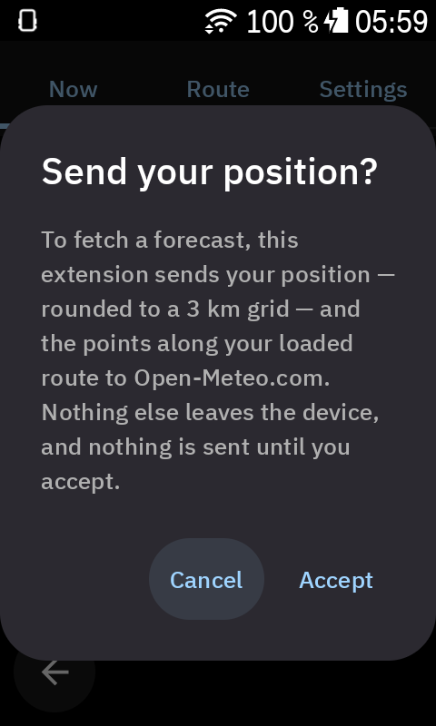
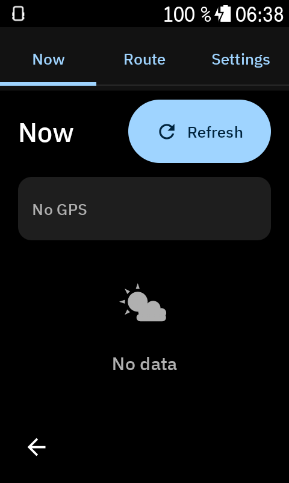
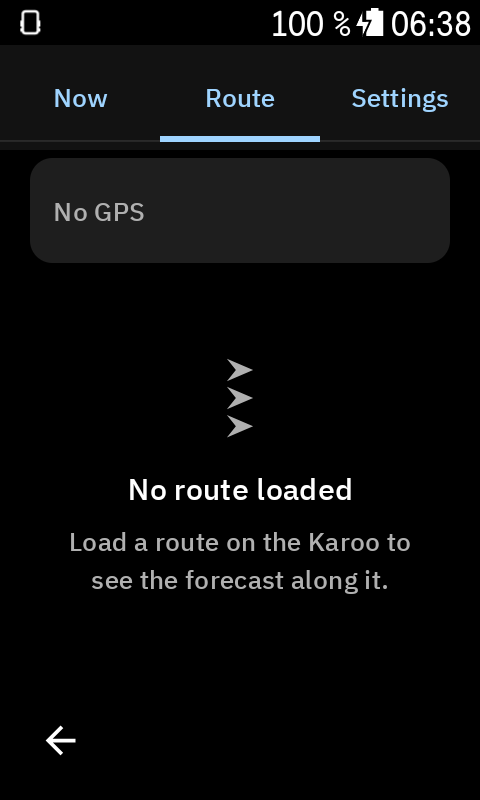
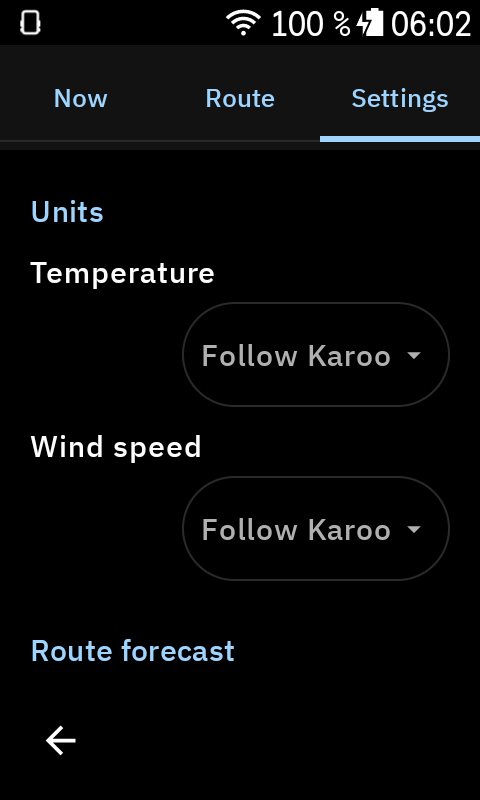

# Documentation

Documents produced while building the extension (research → design → implementation review).
`<ref>/` refers to reference checkouts used during research:
[hammerheadnav/karoo-ext](https://github.com/hammerheadnav/karoo-ext),
[timklge/karoo-headwind](https://github.com/timklge/karoo-headwind),
[jonasfranz/ktor-client-karoo](https://github.com/jonasfranz/ktor-client-karoo).

## Research
- [karoo-sdk.md](research/karoo-sdk.md) — karoo-ext 1.1.9 API deep-dive (events, effects, HTTP limits, views)
- [headwind-patterns.md](research/headwind-patterns.md) — patterns and pitfalls from the karoo-headwind extension
- [weather-apis.md](research/weather-apis.md) — free weather APIs comparison, Open-Meteo request/size measurements
- [karoo-ux.md](research/karoo-ux.md) — Karoo device specs and UX conventions

## Design
- [ARCHITECTURE.md](design/ARCHITECTURE.md) — decisions (no backend, raw MakeHttpRequest, domain model, fetch policy, route algorithm)
- [DESIGN.md](design/DESIGN.md) — visual spec: tokens, typography, per-field mockups, screens
- [PLAN.md](design/PLAN.md) — work packages with file ownership and cross-package contracts
- [CRITIQUE.md](design/CRITIQUE.md) — adversarial review of the design before implementation

## Screenshots (Karoo k24, 480×800)
| Consent | Now | Route | Settings |
|---|---|---|---|
|  |  |  |  |
